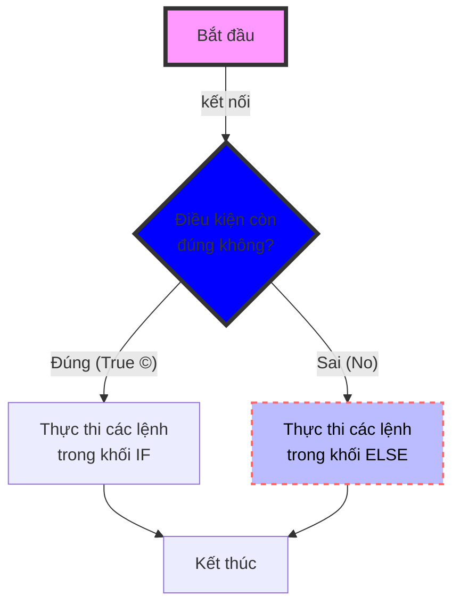
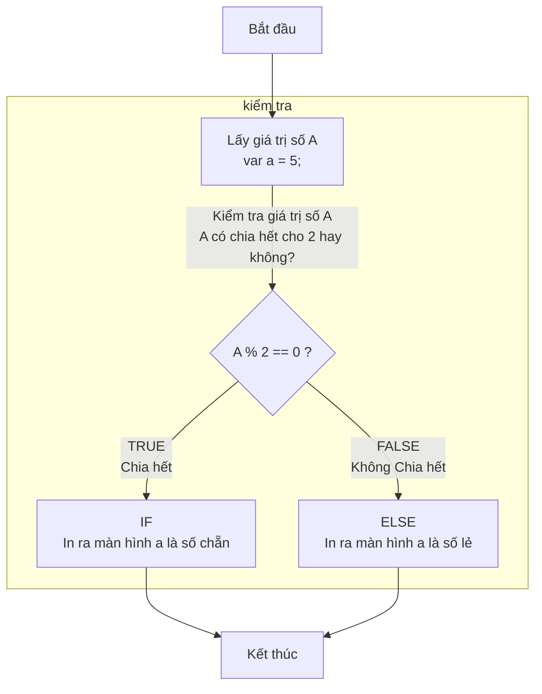
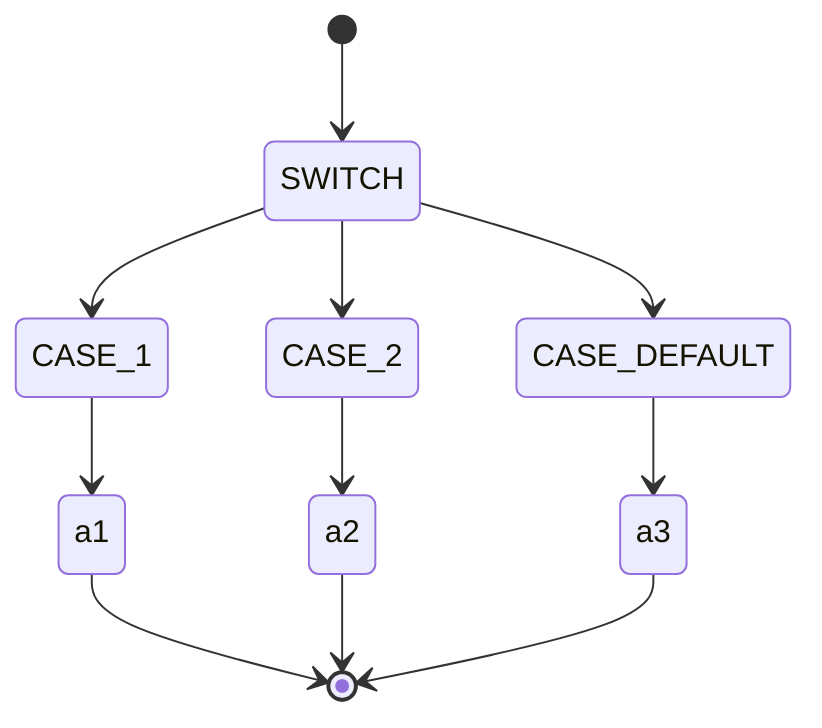

# Ví dụ lưu đồ hoạt động

```mermaid
graph TB;
    A[Bắt đầu] --> |kết nối| B{Điều kiện còn <br />đúng không?}
    B --> |"Đúng (True &copy;)"| C[Thực thi các lệnh <br />trong khối IF]
    B:::style1 --> |"Sai (No)"| D[Thực thi các lệnh <br /> trong khối ELSE]
    C --> KT[Kết thúc]
    D --> KT

    style A fill:#f9f,stroke:#333,stroke-width:4px
    style D fill:#bbf,stroke:#f66,stroke-width:2px,color:#000,stroke-dasharray: 5 5
    classDef style1 fill:#0000ff,stroke:#333,stroke-width:4px;
```

```mermaid
graph TD;
    Start["Bắt đầu"] --> A["Lấy giá trị số A<br />var a = 5;"]
    A --> |"Kiểm tra giá trị số A<br />A có chia hết cho 2 hay không?"| B{"A % 2 == 0 ?"}
    B --> |"TRUE<br/>Chia hết"| Yes["IF<br />In ra màn hình a là số chẵn"]
    B --> |"FALSE<br/>Không Chia hết"| No["ELSE<br/>In ra màn hình a là số lẻ"]
    Yes --> End["Kết thúc"]
    No --> End

    subgraph "kiểm tra"
        A
        B
        Yes
        No
    end
```

```mermaid
stateDiagram
[*] --> SWITCH
SWITCH --> CASE_1
SWITCH --> CASE_2
SWITCH --> CASE_DEFAULT
CASE_1 --> a1
CASE_2 --> a2
CASE_DEFAULT --> a3
a1 --> [*]
a2 --> [*]
a3 --> [*]
```
