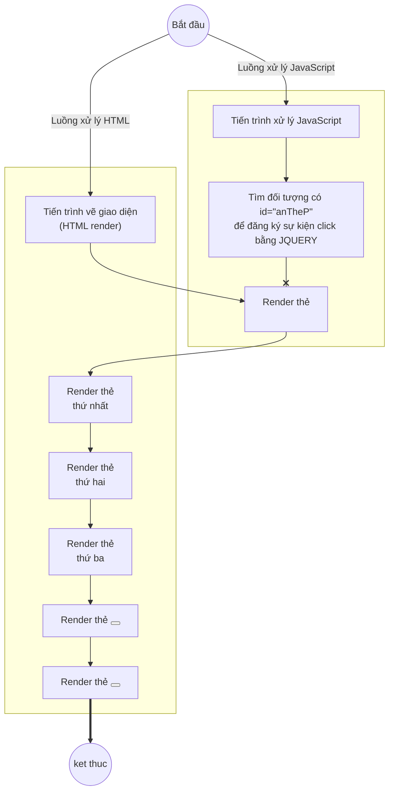
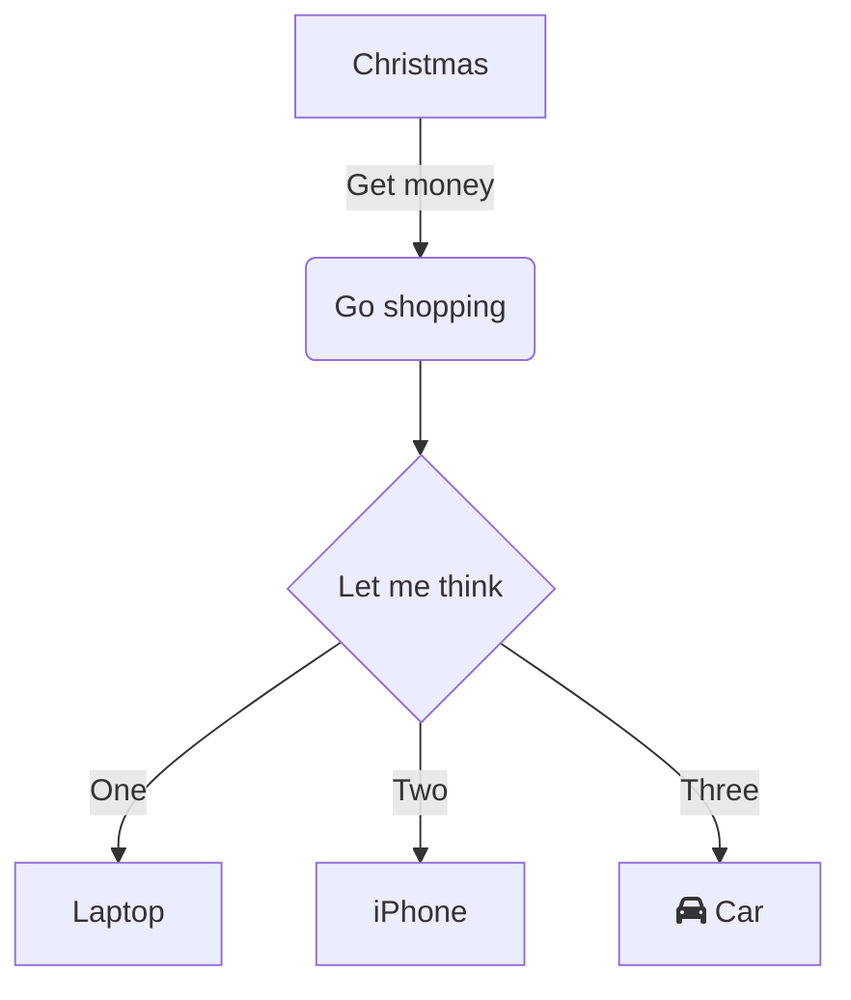

# Bài 1: Cách sử dụng Jquery trong HTML

## Workflow xử lý



## Yêu cầu

- Tạo 3 thẻ <p></p> với nội dung bất kỳ.
- Các nút Button:
  - Nút "Ẩn thẻ P": khi click vào sẽ ẩn giao diện thẻ P.
  - Nút "Hiện thẻ P": khi click vào sẽ hiện giao diện thẻ P.

## Hướng dẫn

### Step 1: download file Jquery

- Truy cập: [https://jquery.com/](https://jquery.com/)

### Step 2: liên kết vào trong file HTML

```js
<!-- Liên kết thư viện Jquery -->
<script src="vendor/jquery/jquery.min.js"></script>
```

### Step 3: sử dụng cú pháp Jquery

```js
<!-- Viết code Jquery -->
<script>
// Tìm đối tượng (element) nào đó => yêu cầu thực thi Hành động gì đó (Action)
// Cú pháp Jquery
// $(selector).action();

// Yêu cầu tiến trình Javascript đợi HTML render (vẽ ra giao diện) xong
// -> JS mới thực thi
$(document).ready(function(e) {
    // Tìm đối tượng có id="anTheP" để đăng ký sự kiện click bằng JQUERY
    $('#anTheP').click(function(e) {
        // Hiển thi hộp thoại
        //alert('Xin chào, bạn vừa click nút Ẩn thẻ P');

        $('p').hide(2000); //2000ms -> 2s
    });

    $('#hienTheP').click(function(e) {
        $('p').show(5000);
    });
});
</script>
```


